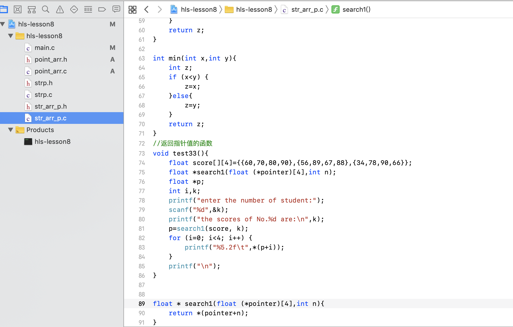

# C-Learn
C-Learn

## 用字符型指针变量作为实参
~~~
//用字符型指针变量作为实参
void test9(){
printf("\n用字符型指针变量作为实参\n");
void copy_string2(char from[],char to[]);
char a[]="I am a teacher.";
char b[]="You are a student.";
char * from=a,* to =b;
printf("stringa=%s\nstringb=%s\n",a,b);
printf("\ncopy string a to string b:\n");
copy_string2(from, to);
printf("string a=%s\nstring b=%s\n",a,b);

}

void copy_string2(char from[],char to[]){
int i=0;
while (from[i]!='\0') {
to[i]=from[i];
i++;
}
to[i]='\0';
}

~~~

## preview

